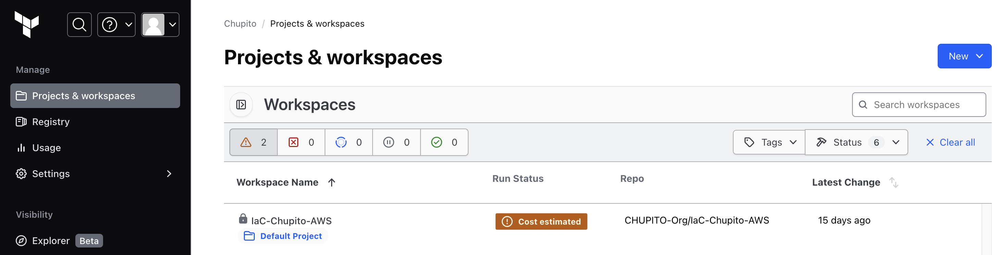
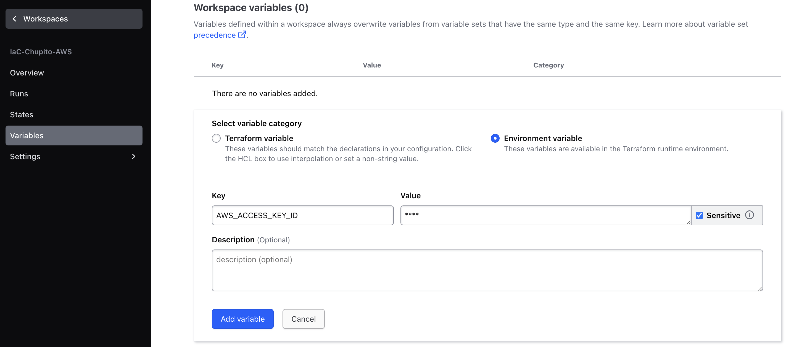
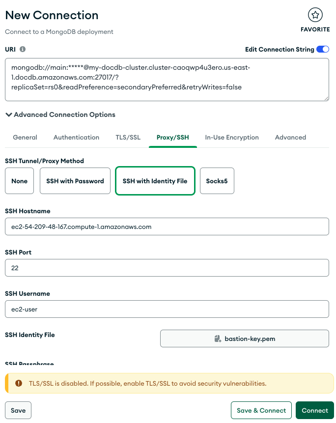

# Chupito Web Application

Deployment of the cloud infrastructure on AWS of Chupito, a web application for event manager.

First start with a brief explanation of the infrastructure designed for AWS. Next, the steps to follow to deploy Chupito in the AWS cloud are explained. Likewise, an Internet Gateway is created to enable internet access to the public subnets and a NAT Gateway is created to enable internet access to the private subnets.

# AWS Architecture


- AWS VPC: the vpc is deployed with 6 subnets, 2 public subnets, 2 private subnets and 2 private database subnets.

- Amazon ECS with Fargate: the frontend and backend are deployed on AWS ECS in a serverless configuration (Fargate) in two availability zones. The ECS configuration communicates constantly with Amazon IAM, Amazon EC2 and Amazon Secrets Manager. ECS communicates with IAM to authorize ECS to pull the frontend and backend images from ECR and send them to ECS. Also, an IAM role is created to be able to access the containers and perform tests. ECS communicates with Secrets Manager to obtain the credentials of the DocumentDB database.

- Amazon DocumentDB (with MongoDB compatibility): non-relational database with 2 instances for each one of the availability zones.

- Amazon EC2 (Bastion Host): an EC2 instance is created that allows connection to the database externally to the Cloud infrastructure from Compass MongoDB.

- AWS ECR: registry to store frontend and backend docker images.

- Amazon IAM: 2 IAM roles are created that will be used by AWS ECS.

- AWS Secrets Manager: store authentication credentials for the DocumentDB database.

For more details about AWS Architecture click on [here](https://github.com/CHUPITO-Org/IaC-Chupito-AWS/blob/main/docs/ADR/v3/ArchitectureAWS_v3.md)

Demo [video](https://mckinsey.ent.box.com/file/1390282328886). Ask for access to **Digital junior capabilities - Spanish LATAM**

# Deploy Chupito on AWS

## 1) Pre-requisites

Before deploying the AWS infrastructure, some initial configurations mentioned below are required:

- AWS user

User with AdministratorAccess and AmazonECS_FullAccess permissions policies.
If it is not a new account, delete any artifacts previously created in the account.

- Local packages

Install terraform and git for MacOS:

```
brew install git
brew install terraform
```

- Terraform

Request access to Chupito organization in [Terraform Cloud](https://app.terraform.io/app/Chupito/workspaces). Get access to the **IaC-Chupito-AWS** workspace:



First, click on the **workspace** IaC-Chupito-AWS. Then click on **Variables**. Then, add AWS environment variables to Workspace variables as sensitive variables:



```
AWS_ACCESS_KEY_ID=***
AWS_SECRET_ACCESS_KEY=***
AWS_SESSION_TOKEN=*** [OPTIONAL]
```

Get values ​​from "Access keys" in IAM user. create access keys if it is necessary.

Download MondoDB Compass here: [MongoDB Compass](https://www.mongodb.com/try/download/compass)

## 2) Deploy AWS infrastructure for Chupito

As a first step, the IaC-Chupito-AWS repository is downloaded locally:

```
git clone git@github.com:CHUPITO-Org/IaC-Chupito-AWS.git
```

Now, having the infrastructure locally there are two options to deploy it:

1. Terraform Cloud: the infrastructure is deployed every time an update is made to the main branch through terraform cloud. To destroy the infrastructure access Terraform Cloud.

2. Locally: the infrastructure is deployed locally with the following commands:

```
terraform init
terraform validate
terraform plan
terraform apply
```

To destroy the infrastructure use the command:

```
terraform destroy
```

## 3) Upload docker images to AWS ECR

Consider modifying the **REACT_APP_BASE_PATH** frontend variables before building the image and and assign the DNS value of the internal load balancer. For example:

```
REACT_APP_BASE_PATH=http://internal-demo-app-internal-252650492.us-east-1.elb.amazonaws.com/v1/
```

Consider modifying the following backend variables before building the image:

```
DB_ROOT_USERNAME=main
DB_ROOT_PASSWORD=h0JZPZMzz9otyCuF
MONGODB_URI='mongodb://main:<insertYourPassword>@my-docdb-cluster.cluster-caoqwp4u3ero.us-east-1.docdb.amazonaws.com:27017/?replicaSet=rs0&readPreference=secondaryPreferred&retryWrites=false'
DEFAULT_DB='mongodb'
```

With the variables mentioned above, build the two images and tag them as follows:

```
[Frontend image]
docker image tag ms-conference-ui:latest <account_id>..dkr.ecr.us-east-1.amazonaws.com/frontend-image:latest

[Backend image]
docker image tag ms-conference-bff:latest <account_id>..dkr.ecr.us-east-1.amazonaws.com/backend-image:latest
```

Authenticate with AWS ECR:

```
aws ecr get-login-password --region us-east-1 | docker login --username AWS --password-stdin <account_id>..dkr.ecr.us-east-1.amazonaws.com
```

Upload the images to the container registries:

```
[Frontend image]
docker image push <account_id>.dkr.ecr.us-east-1.amazonaws.com/frontend-image:latest

[Backend image]
docker image push <account_id>.dkr.ecr.us-east-1.amazonaws.com/backend-image:latest
```

Check that the application is running by accessing the public load balancer DNS. For example:

```
http://demo-app-1446936410.us-east-1.elb.amazonaws.com
```

## 4) Access to AWS DocumentDB with Bastion Host

Open Compass MongoDB, create a new connection and copy the following URI:

```
mongodb://main:<insertYourPassword>@my-docdb-cluster.cluster-caoqwp4u3ero.us-east-1.docdb.amazonaws.com:27017/?replicaSet=rs0&readPreference=secondaryPreferred&retryWrites=false
```

Open **Advanced Connection Options**, click on **Proxy/SSH** -> **SSH with Identity File**. Add bastion host credentials, upload **bastion-key.pem** and connect:

```
SSH Hostname: ec2-54-209-48-167.compute-1.amazonaws.com [example value]
SSH Port: 22
SSH Username: ec2-user
```



Now, the database collections can be created.

NOTE: the Bastion Host is designed to be deployed and destroyed when necessary without affecting the infrastructure already created. Modify the following variable:

```
variable "bastion_creation" {
  type        = bool
  description = "Create Bastion: true or false"
  default     = false
}
```

# Test

To access the frontend and backend containers use the following commands:

```
[FRONTEND]
aws ecs update-service --cluster cluster-app --service frontend-service --region us-east-1 --enable-execute-command --force-new-deployment

aws ecs execute-command --cluster cluster-app --task <task-id> --container frontend-image --command "/bin/sh" --interactive

[BACKEND]
aws ecs update-service --cluster cluster-app --service backend-service --region us-east-1 --enable-execute-command --force-new-deployment

aws ecs execute-command --cluster cluster-app --task <task-id> --container backend-image --command "/bin/sh" --interactive
```
