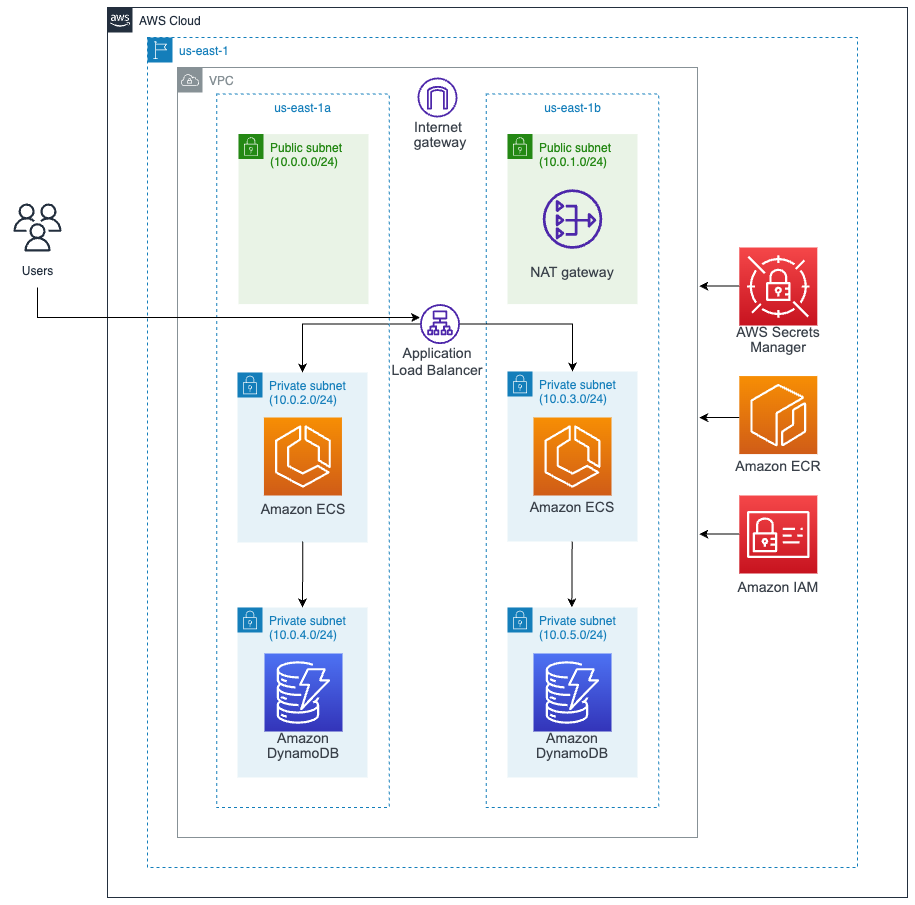

# AWS Architecture

## Infrastructure

Region: North Virginia (us-east-1)

* AWS VPC:
* Amazon ECS with EC2:
* Amazon DynamoDB:
* AWS Secrets Manager:
* AWS ECR:
* Amazon IAM:

## Infrastructure Cost

Cost per month for 24 hours:

* AWS VPC: 32,89 USD
* Amazon EC2: 15,18 USD  - 2 instances - instance type: t3.micro  vCPUs: 2 GiB Memory: 1 GiB
* Amazon DynamoDB: 14,21 USD - provisioned capacity, Backup and restore, Data Import and Export from Amazon S3
* AWS Secrets Manager: 0,40 USD - Number of secrets: 1 (DynamoDB) Average duration of each secret: 30 days API calls: 50
* AWS ECR: 0,10 USD - Amount of data stored: 1 GB
* Amazon IAM: 0 USD

**Total cost: 62,78 USD**

**Check Cost Estimate provided by AWS:** [Excel with costs](https://github.com/CHUPITO-Org/IaC-Chupito-AWS/blob/main/docs/ADR/v1/Costs_Estimate_v1.csv)

**AWS Pricing Calculator:** https://calculator.aws/#/addService

