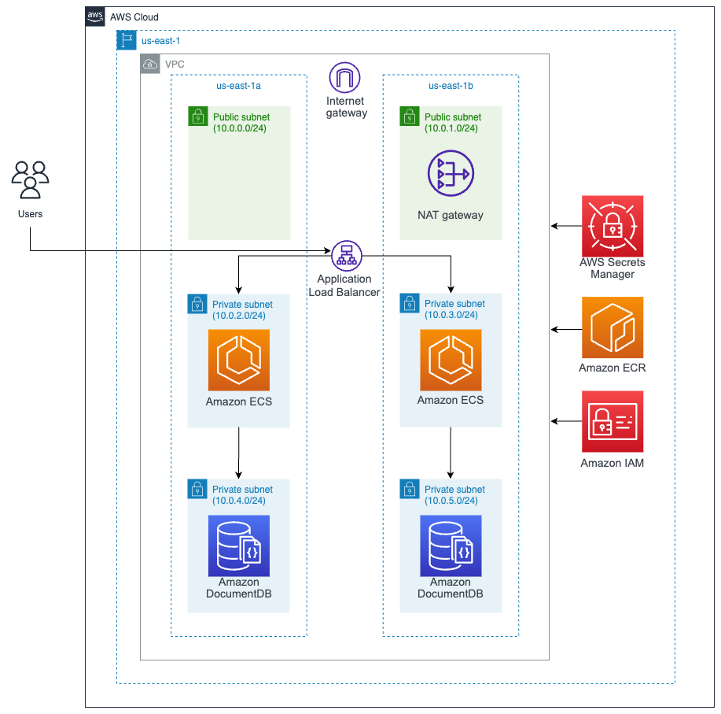

# AWS Architecture

## Infrastructure

Region: North Virginia (us-east-1)

* AWS VPC:
* Amazon ECS with Fargate:
* Amazon DocumentDB:
* AWS Secrets Manager:
* AWS ECR:
* Amazon IAM:

## Infrastructure Cost

Cost per month for 24 hours:

* AWS VPC: 32,89 USD
* AWS Fargate: 1,77 USD  - Operating system: Linux - Number of tasks or pods: 2 
* Amazon DocumentDB: 27,24 USD - Number of instances: 2 Instance type: db.t4g.medium (VCPU: 2 & Memory: 4 GiB)
* AWS Secrets Manager: 0,40 USD - Number of secrets: 1 (DynamoDB) Average duration of each secret: 30 days API calls: 50
* AWS ECR: 0,10 USD - Amount of data stored: 1 GB
* Amazon IAM: 0 USD

**Note:** 
-Amazon Fargate instead of Amazon EC2 with Amazon ECS for PaaS deployment.
-Amazon DynamoDB is replaced by Amazon DocumentDB, since the application is designed to perform queries with a CosmosDB database. The Amazon database that supports these features is CosmosDB.

**Total cost: 62,40 USD**

**Check Cost Estimate provided by AWS:** [Excel with costs](https://github.com/CHUPITO-Org/IaC-Chupito-AWS/blob/main/docs/v2/Costs_Estimate_v2.csv)

**AWS Pricing Calculator:** https://calculator.aws/#/addService

