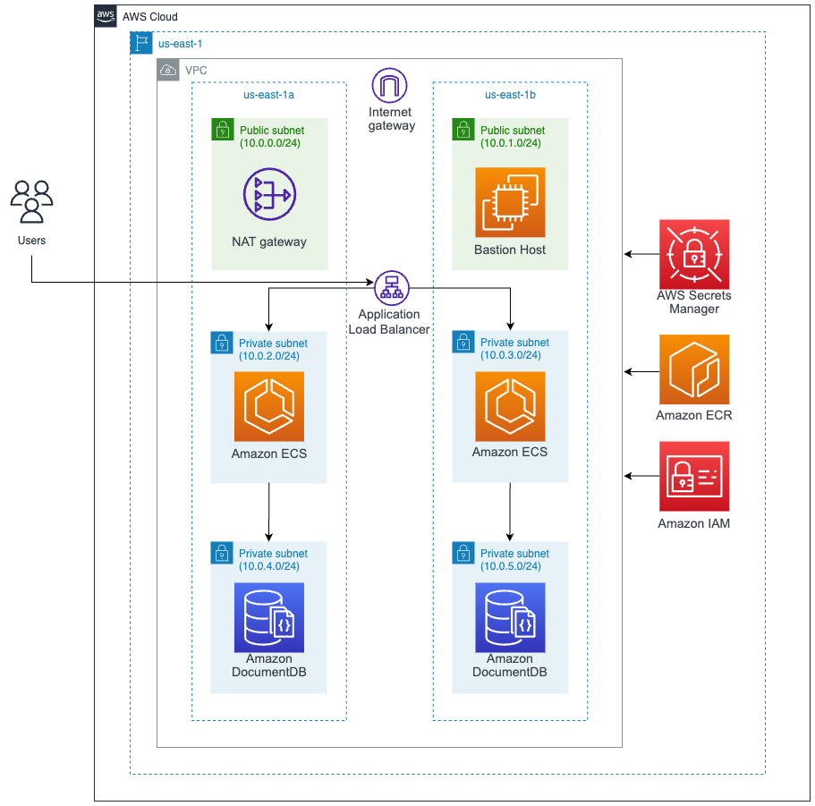
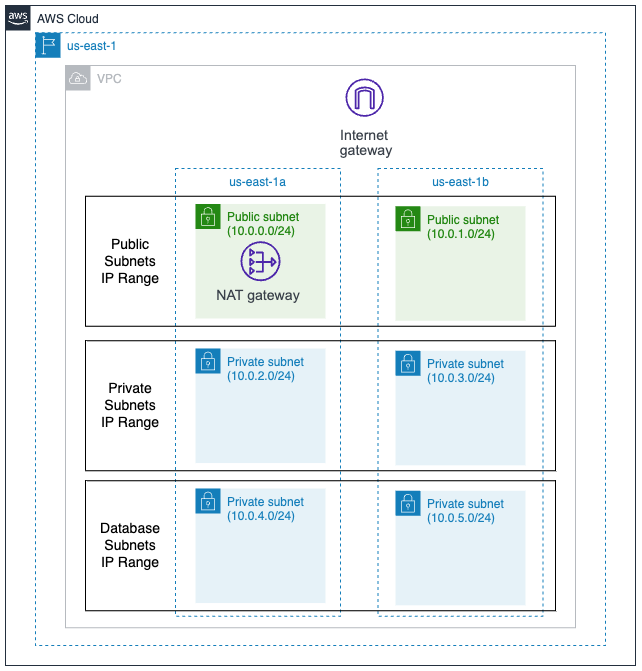
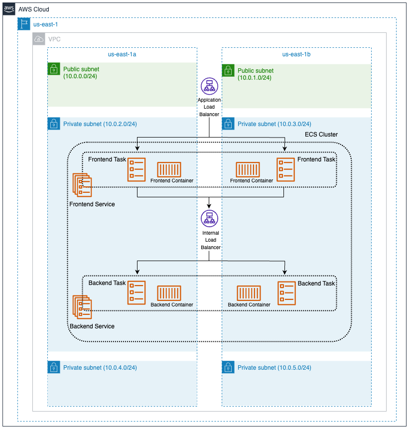
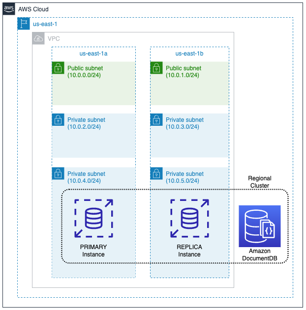
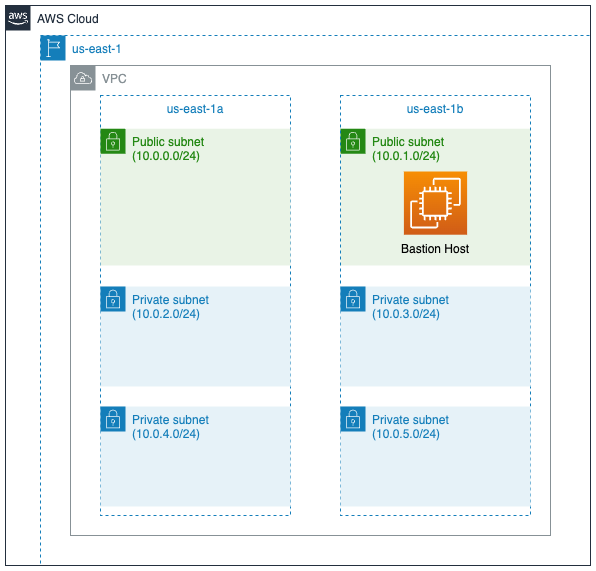

# AWS Architecture

## Infrastructure



Region: North Virginia (us-east-1)

* AWS VPC: the vpc is deployed with 6 subnets, 2 public subnets, 2 private subnets and 2 private database subnets.

* Amazon ECS with Fargate: the frontend and backend are deployed on AWS ECS in a serverless configuration (Fargate) in two availability zones. The ECS configuration communicates constantly with Amazon IAM, Amazon EC2 and Amazon Secrets Manager. ECS communicates with IAM to authorize ECS to pull the frontend and backend images from ECR and send them to ECS. Also, an IAM role is created to be able to access the containers and perform tests. ECS communicates with Secrets Manager to obtain the credentials of the DocumentDB database.

* Amazon DocumentDB (with MongoDB compatibility): non-relational database with 2 instances for each one of the availability zones. 

* Amazon EC2 (Bastion Host): an EC2 instance is created that allows connection to the database externally to the Cloud infrastructure from Compass MongoDB.

* AWS ECR: registry to store frontend and backend docker images.

* Amazon IAM: 2 IAM roles are created that will be used by AWS ECS. 

* AWS Secrets Manager: store authentication credentials for the DocumentDB database.


## Infrastructure Cost

Cost per month for 24 hours:

* AWS VPC: 32,89 USD
* AWS Fargate: 1,77 USD  - Operating system: Linux - Number of tasks or pods: 2 
* Amazon DocumentDB: 27,24 USD - Number of instances: 2 Instance type: db.t4g.medium (VCPU: 2 & Memory: 4 GiB)
* AWS Secrets Manager: 0,40 USD - Number of secrets: 1 (DynamoDB) Average duration of each secret: 30 days API calls: 50
* AWS ECR: 0,10 USD - Amount of data stored: 1 GB
* Amazon IAM: 0 USD

**Note:** 
-Amazon Fargate instead of Amazon EC2 with Amazon ECS for PaaS deployment.
-Amazon DynamoDB is replaced by Amazon DocumentDB, since the application is designed to perform queries with a CosmosDB database. The Amazon database that supports these features is CosmosDB.


**Total cost: 62,40 USD**

**Check Cost Estimate provided by AWS:** [Excel with costs](https://github.com/CHUPITO-Org/IaC-Chupito-AWS/blob/main/docs/Costs_Estimate_v3.csv)

**AWS Pricing Calculator:** https://calculator.aws/#/addService

## AWS VPC (Networking)

The VPC is created in the North Virginia region (us-east-1) to make use of two availability zones (us-east-1a and us-east-1b), achieving high availability in case any zone fails.

```
Region: North Virginia [us-east-1]
Availability Zones: [us-east-1a, us-east-1b]
```

Next, the network segmentation for the Chupito infrastructure is: 

```
10.0.0.0/16
```

According to the segmentation and availability zones mentioned above. Then, the segmentation of the chupitos subnets are created with the following configuration:

* 2 Public Subnets: [10.0.0.0/24, 10.0.1.0/24]
* 2 Private Subnets: [10.0.2.0/24, 10.0.3.0/24]
* 2 Databases Subnets: [10.0.4.0/24, 10.0.5.0/24]

In the public subnets an EC2 instance is hosted that works as a Bastion Host and a Load Balancer Application as a router. 

In the private subnets 2 Amazon ECS services are hosted within the same cluster and an internal load balancer as a router.

In the database subnets 2 instances of the AWS DocumentDB database are hosted.

This is explained in more detail below.



## Amazon ECS with Fargate (Compute)

Chupito is deployed on AWS Elastic Container Service (ECS) with serverless configuration (Fargate) in 2 private subnets.

An ECS cluster is created with 2 services, 1 service for the frontend and 1 for the backend. Each service contains 2 tasks, 1 task per availability zone for a total of 4 tasks.

```
Cluster: 1 cluster

Frontend Service: 1 service
  Backend Task: 2 tasks
  
Backend Service: 1 service
  Backend Task: 2 tasks

Total Clusters: 1 
Total Services: 2 
Total Taks: 4

2 Private Subnets: [10.0.2.0/24, 10.0.3.0/24]
```

Likewise, the configuration has 2 Application Load Balancers, 1 Load Balancer exposed to the internet and the other without internet exposure.

The first load balancer is in charge of distributing the incoming internet traffic to the frontend service in the two availability zones. 

The second load balancer is in charge of distributing the information provided by the frontend to the backend in the two availability zones.

The following is the configuration explained above:



## Amazon DocumentDB (Storage)

AWS DocumentDB is deployed as a non-relational database compatible with MongoDB in 2 private subnets.

```
2 Databases Subnets: [10.0.4.0/24, 10.0.5.0/24]
```

A cluster is created for a regional database with 2 replicas, one replica in each of the availability zones.



## Amazon EC2 (Bastion Host)

The Bastion is a host server that allows secure access to the DocumentDB database externally (MongoDB Compass tool) to the VPC.



To connect to MongoDB compass it is important to have the following information (example values):

```
Username: root
Password: ***
Endpoint DB: my-docdb-cluster.cluster-caoqwp4u3ero.us-east-1.docdb.amazonaws.com
Port DB: 27017
SSH Hostname: ec2-54-209-48-167.compute-1.amazonaws.com 
SSH Port: 22
SSH Username: ec2-user
File: bastion-key.pem
SSL/TLS Connection: off
```

## AWS ECR (Registry)

2 container registries are created, 1 for the frontend image and the other 1 for the backend image with the following names:


```
Private repositories:

-> frontend-image
-> backend-image
```


## Amazon IAM (Policiy)

2 IAM roles are created that will be used by AWS ECS. The **ecsTaskExecutionRole** role allows to take the AWS ECR image, send it to the ECS task for each of the services for further execution. The second **ecsTaskRole** role allows to access the frontend and backend containers deployed in AWS ECS.

```
IAM Roles:

  1. ecsTaskExecutionRole
  2. ecsTaskRole
```


## AWS Secrets Manager (Security)

AWS Secret Manager is used to store authentication credentials for the DocumentDB database.

